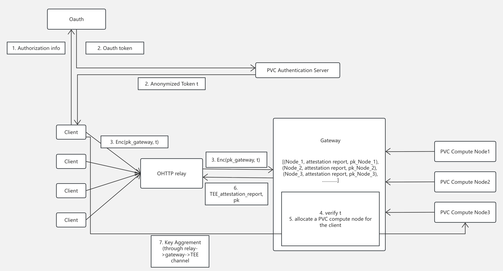

# Private Verifiable Cloud with Anonymous Routing

## Overview

Anonymous routing within the Private Verifiable Cloud (PVC) framework anonymizes client traffic while ensuring that only verified PVC nodes can serve authorized clients. This architecture preserves client anonymity even if an adversary gains control over a compute node or gateway; attackers cannot target specific users or access their private data. The solution integrates anonymous authentication, Oblivious HTTP (OHTTP) for traffic routing, remote attestation to verify node integrity, and a stateful session mechanism to maintain secure and reliable communication.

## Workflow

The high‑level workflow is illustrated by the diagram below.

### Authorization and token issuance (Step 1 - 2)

The client begins by authenticating through a non-anonymized channel. For example, it may directly submit its username and credentials to the PVC Authentication Server, which verifies whether the client is a registered user of the PVC. Alternatively, if the system supports external identity mechanisms such as OAuth, the client first completes the OAuth authorization process and then presents the issued OAuth token to the PVC Authentication Server for identity verification.

In response, the PVC Authentication Server issues an anonymous token `t` signed via a blind signature scheme, ensuring that the server cannot associate the signed token with any specific client identity. To prevent misuse and maintain service fairness, the Authentication Server may enforce rate-limiting policies, such as capping the number of tokens a user can obtain within a defined period (e.g., per day), thereby mitigating abuse and balancing system load.

### Encrypted token submission via OHTTP (Step 3)

 The client prepares its request by encrypting the anonymized token `t` under the gateway’s public key, and transmits the encrypted payload through Oblivious HTTP (OHTTP). OHTTP separates the sender’s identity from the content of the request, providing strong network-level anonymity through the following process:

 1. The client encrypts its HTTP request using the gateway’s public key, and sends it to an OHTTP relay.

 2. The relay drops all  personally identifiable information (e.g., client IP address), and forwards the encrypted request to the gateway.

 3. The gateway decrypts the request using its private key and processes the contained data.

In this setup, the relay learns only the client’s and gateway’s network endpoints but cannot access the encrypted request content, while the gateway receives the plaintext request but has no knowledge of the client’s identity. This separation ensures unlinkability between client identity and request content.

### Gateway operations (Step 4 - 5)

Client requests consist of an anonymous token `t` and application-specific payload data. Upon receiving the request, the gateway first verifies that t has been correctly signed by the PVC Authentication Server, ensuring the request originates from a legitimate and authorized client. It then selects an appropriate subset of PVC compute nodes to handle the task.

Note that the communication through anonymous routing is stateless. Namely, the gateway cannot figure out whether any two packets originate from the same PVC client. However, some applications require stateful communication (even the key aggreement prorotocols are inherent stateful). Therefore, we ask the PVC client to use the same anonymous token `t` in multiple packets if the target application is stateful.

The gateway maintains a routing table that maps each token `t` to its assigned PVC compute node, allowing all packets with the same token to be routed consistently to the same node. Meanwhile, the PVC compute node itself stores the session state associated with that token.

In summary, the system uses the anonymous token as a lightweight session identifier, enabling stateful communication without revealing user identities. The gateway can only observe metadata such as the number of packets per session, which is typically non-sensitive in most deployment scenarios.

### Establish secure channel between the client and PVC compute node (Step 6 - 7)

After the gateway selects a PVC compute node, it returns the node’s attestation evidence to the client. The client verifies this evidence to ensure that the compute node is running trusted and untampered code within a verified TEE environment.

Once attestation succeeds, PVC establishes an end-to-end encrypted channel between the client and the compute node using the Noise framework. This secure channel guarantees confidentiality, integrity, and forward secrecy for all subsequent communication, ensuring that even intermediaries such as the gateway or relay cannot access session contents. Refer to [this document](./noise.md) for more details about the integration of attestation verification and the noise framework.

### Secure computation and response

The client sends its encrypted payload (for example, an AI inference request) to the PVC compute node through the same OHTTP channel. The PVC compute node decrypts the request, loads the model associated with the client, performs the computation, encrypts the result, and returns it to the client. Meanwhile, the PVC compute node updates the state of the corresponding anonymous token (e.g., mark the session as finished) to defend against replay attacks.

# Conclusion

This workflow ensures that the client’s identity is hidden from the gateway and PVC compute node, the PVC compute node is verifiably trustworthy, and the private payload is only visible to the PVC compute node.
