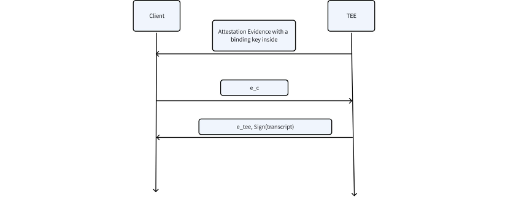

# Establishing Secure and Attested Communication Channel with PVC Compute Node

In PVC, the clients need to send their private input data to the PVC compute nodes securely.
To achieve this, we need to establish a secure, authenticated, and attested communication channel between the clients and the compute nodes. The desired properties are as follows:

1. **Security**: The communication channel must be protected from eavesdropping, tampering, or replay attacks. Only the PVC compute node can access the private input data.

2. **Authentication**: The client and the PVC compute node must be able to authenticate each other.

3. **Attestation**: The compute node must be able to provide attestation to the client, i.e., to prove that it is running on a trusted hardware platform.

We decide to use the **Noise Framework** to establish the encryption channel to fullfill Security and Authentication, while the Attestation is handled through attestation report verification.

## 1. Noise Framework

The **Noise Framework** is a general framework to achieve key agreement with Diffie-Hellman protocols.
The benefit is that it has **formal security proofs** and is **easy to follow**.
It defines multiple “patterns” to fit various desired properties and key settings.

## 2. How to Integrate Noise Framework with PVC
To begin with, the PVC clients need to go through the anonymous routing process to establish a route between a client and the PVC Compute Node. The route goes through the PVC Client, the third party routing service, PVC gateway, and the PVC Compute Node (as mentioned in our Anonymous Routing document). After this step, an HTTP/HTTPS channel is established between PVC clients and PVC compute nodes. The design in this doc is built as an application layer protocol on top of the HTTP/HTTPS channel.

Our requirement is as follows:

1. There is no need for the client (so-called *Initiator* in the Noise framework) to authenticate itself within Noise, because we will handle it in another layer (by verifying the signature of the anonymous token).

2. We need a mechanism to guarantee the identity of the PVC compute node (the *Responder*) through attestation report verification.

3. The client needs to verify that the verified attestation report indeed comes from the PVC compute node that it is communicating with.

This can be achieved with the help of a **binding key** as below (inspired by [Google’s talk](https://www.youtube.com/watch?v=H52Kbbc8A5g)).

The first step is a standard attestation report verification, and the extra step is to insert a binding key (signature verification key) into the report data.
The binding key is generated by the PVC compute node such that the corresponding signing key is only accessible within the compute node.
Then the client and the PVC compute node launch the noise protocol with several rounds of communication. Finally, the PVC node will include a signature in the last round of communication, and the signed message is the entire transcript of the messages sent by both parties.

---

## 3. General Workflow

1. PVC Compute Node
    - Generate a signature key pair (pk, sk).
    - Add the binding key pk to the report data, if the key is too large, we can store the hash of the key in the report data, and send the key separately.
    - Send the report with other attestation evidence to the client.

2. Client
    - Verify the attestation report.
    - Launch the noise protocol with the PVC Compute Node.

3. PVC Compute Node
    - Finish the noise protocol.
    - In the last message of the noise protocol, include the signature of the entire key exchange transcript with sk.
